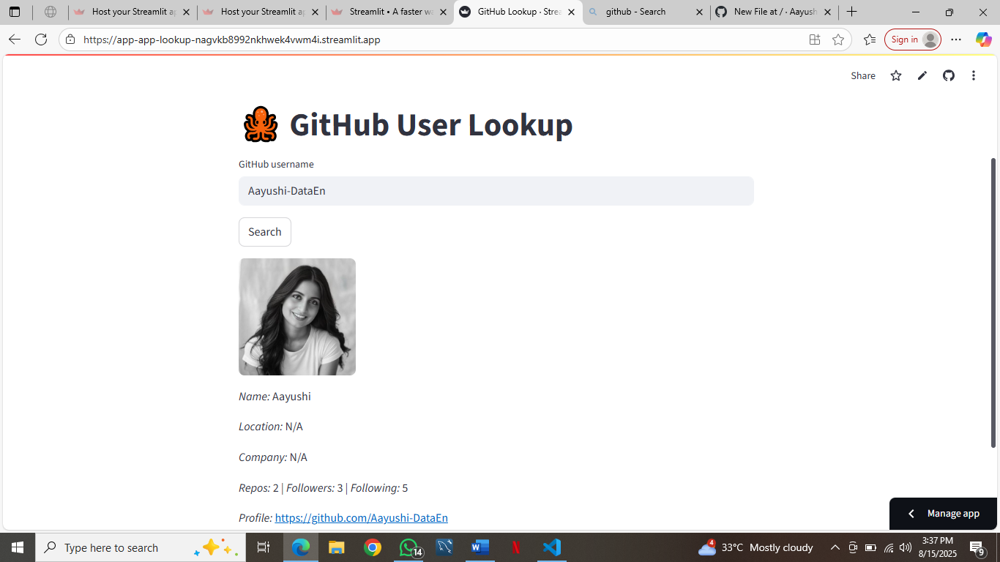

# **GitHub Profile Lookup – Streamlit Web App**

## Search. Click. Discover.
Easily explore any GitHub profile by entering a username.  
This app uses the GitHub REST API to display profile details.

### **Features**
- *Instant Search* – Enter any GitHub username and view results in seconds.
- *Profile Overview* – Displays name, location, company, and public repositories.
- *Social Stats* – Shows followers and following counts.
- *Profile Picture* – Displays the user’s GitHub avatar.
- *Direct Profile Link* – Clickable link to open the GitHub profile.
- *Error Handling* – Friendly message when a user is not found.

### **Demo**
Example search for Aayushi-DataEn: 


### **Tech Stack**
- Python 3.x – Core programming language.
- Streamlit – Framework for creating the interactive web interface.
-	Requests – For making API calls to GitHub.
-	GitHub REST API – Source of profile data.


## **Installation & Setup**

### **1. Clone this repository**
```bash
   git clone https://github.com/Aayushi-DataEn/Streamlit-github-lookup
   cd Streamlit-github-lookup```

### **2. Create and activate a virtual environment (optional but recommended)
```bash
    python -m venv venv
    venv\Scripts\activate``` 

### **3. Install Dependencies**
```bash
    pip install -r requirements.txt```

### **4. Run the app**
```bash
    streamlit run app.py```

### **5. Open in browser**
Local URL: [https://localhost:8501](https://localhost:8501)

## **Usage**
1. Enter a **GitHub username** (e.g., Aayushi-DataEn) into the text box.
2. Click search.
3. View the fetched profile information, avatar, and stats instantly.

## **Deployment**
You can deploy this app for free using **Streamlit Community Cloud:**
1. Push your code to Github
2. Go to [https://share.streamlit.io/](https://share.streamlit.io/)
3. Connect your Github account and select your repository.
4. Deploy and share your app link with others.


